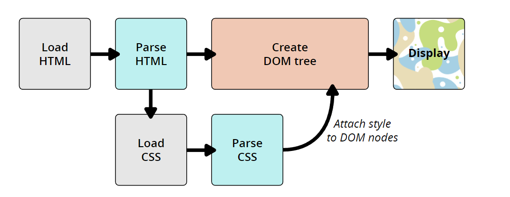
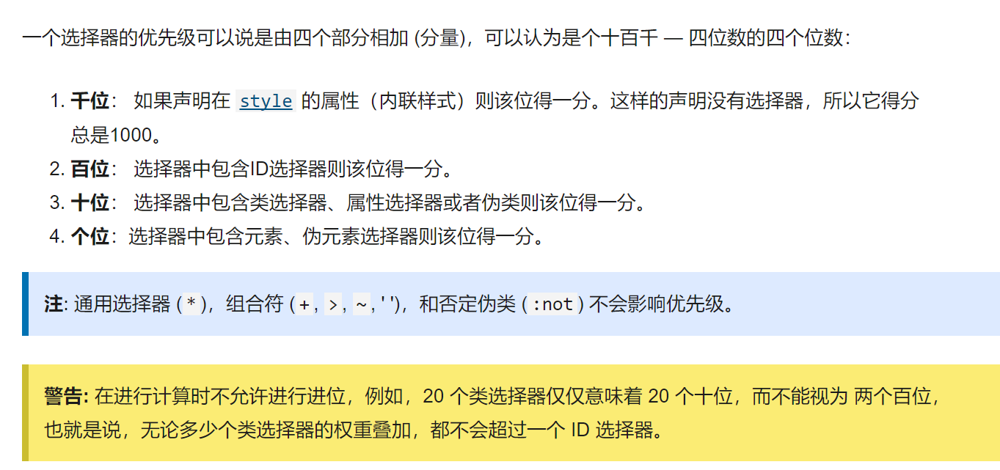

# CSS基础学习

> CSS（Cascading Style Sheets）层递样式表
>
> 参考：[学习CSS](https://developer.mozilla.org/zh-CN/docs/Learn/CSS/First_steps)


[TOC]

​	CSS（层叠样式表）用于设置和布置网页 - 例如，更改内容的字体，颜色，大小和间距，将其拆分为多个列，或添加动画和其他装饰功能。


## CSS基本语法

### 为HTML链接CSS

让 HTML 文档能够遵守我们给它的 CSS 规则， 最普遍且有用的方式——在文档的开头链接 CSS。

在与之前所说的 HTML 文档的相同目录创建一个文件，保存并命名为 `styles.css` 。（看后缀知道此文件就是 CSS 文件）

为了把 `styles.css` 和 `index.html` 连接起来，可以在 HTML 文档中，`<head>`语句模块里面加上下面的代码：

```html
<link rel="stylesheet" href="styles.css">
```

### 使用类名

给HTML元素添加类名，如`<li class="special">`，在CSS中，要对这个类进行设计，代码格式如下：

```css
.special {
  color: orange;
  font-weight: bold;
}
```

### 根据元素在文档中的位置确定样式

```css
li em {
  color: rebeccapurple;
}
```

如上代码，表示选择器将选择`<li>`内部的任何`<em>`元素（`<li>`的后代）

如果在两个选择器间用一个**相邻选择符**即`+`，可以使得两个选择器有同一个样式，示例代码如下

```css
h1 + p {
  font-size: 200%;
}
/*上数代码表示，h1和p对应的格式字体大小均调整为200%*/
```

### 根据状态确定样式

应用例子：

​	当我们修改一个链接的样式时我们需要定位（针对） `<a>` （锚）标签。取决于是否是未访问的、访问过的、被鼠标悬停的、被键盘定位的，亦或是正在被点击当中的状态，这个标签有着不同的状态。

​	可以使用CSS去定位或者说针对这些不同的状态进行修饰——下面的CSS代码使得没有被访问的链接颜色变为粉色、访问过的链接变为绿色，鼠标悬停时下划线消失。

```css
a:link {
  color: pink;
}

a:visited {
  color: green;
}
a:hover{
    text-decoration: none;    
}
/*在 CSS 定义中，:hover 必须位于 :link 和 :visited 之后（如果存在的话），这样样式才能生效。*/
```


### 内部样式表

​	有时，使用的内容管理系统不能编辑CSS文件，就可以使用该方法来设计样式。在`<head>标签中借助<style>来实现`。但是，这种设计样式的方法并不高效，不同页面要用同样样式的话，需要反复设置。


### 专一性

有时，对于同一个选择器定义了两种规则，那么，**稍后的样式**将会替代后头的样式，如下例子

```css
p {
  color: red;
}

p {
  color: blue;
}
```

在上述例子中，如果我们有一段文字，那么他的颜色是`blue`

之前也提过，可以给元素加**类名**（如`special`），可以通过类名来定义规则，如下：

```css
.special {
  color: red;
}

p {
  color: blue;
}
```

在这种情况下，文字的颜色为`red`，类的优先级更高。**一个类被描述为比元素选择器更具体，或者具有更多的特异性，所以它获胜了**


### 函数

在教程的示例中，用`calc`函数进行了简单的计算，借助`<div>`标签实现了简单的进度条（伪）

```html
    <!-- div是一个块级元素 -->
    <div class="outer"><div class="box">The inner box is 90% - 30px.</div></div>
    <p>可以理解为下述两部分嵌套而成</p>
    <div class="outer">The inner box is 90% - 30px.</div>
    <div class="box">The inner box is 90% - 30px.</div>
```

```CSS
/* 接下来的部分控制进度条 */
.outer {
    border: 5px solid black;
    /* width: 100%; */
  }
  
.box {
    padding: 5px;
    /* 内边距 */
    width: calc(90% - 0px);
    /* 框的宽度为包含块宽度的90%，减去30像素 */
    /* 但是发现设置为100时，将超出框的大小，那么框的宽度如果不加100%的设置的话，为什么默认时不满呢 */
    background-color: rebeccapurple;
    /* 背景颜色为紫色，字体为白色 */
    color: white;
}
```

这里有一个**疑问**，在`outer`类中，如果不设置宽度，将默认为一个并不满的宽度，这是什么原因？


### @规则

如果需要将额外的样式表导入主样式表，可以使用`@import`进行导入：

```css
@import "styles2.css";

```

最常见的应用是`@media`，允许使用**媒体查询**来应用CSS，今当某些条件成立

> **媒体查询**可以根据各种设备特征和参数的存在或价值来调整网站或应用程序。
>
> 在CSS中，根据媒体查询的结果有条件的应用样式表的一部分。

应用示例为：

```css
  /* 这里练习@rules常见的应用：@media */
  body {
    background-color: pink;
  }
  /* 当宽度大于30em的时候为绿色，否则为粉色 */
  @media (min-width: 30em) {
    body {
      background-color:cadetblue;
    }
  }
```

关于上文中提到的一个单位`em`：

> 参考链接：[CSS中的em应用详解](https://blog.csdn.net/jingru2017/article/details/79099464)
>
> 文章中讲的非常详细，简单了解到em大概是这样一个东西：
>
> ​	弹性设计有一个关键地方，Web页面中所有元素都使用“em”单位值。“em”是一个相对的大小，我们可以这样来设置1em，0.5em，1.5em等，而且“em”还可以指定到小数点后三位，比如“1.365em”。
>
> ​	而其中“相对”的意思是：相对于元素父元素的font-size。
>
> ​	比如说：如果在一个<div>设置字体大小为“16px”，此时这个<div>的后代元素教程了是将继承他的字体大小，除非重新在其后代元素中进行过显示的设置。此时，如果你将其子元素的字体大小设置为“0.75em”，那么其字体大小计算出来后就相当于“0.75 X 16px = 12px”


## CSS如何运行

基本步骤为：

1. 浏览器载入HTML文件
2. 将HTML文件转化成一个DOM（Document Object Model）
3. 接下来，浏览器会拉取该HTML相关的大部分资源，比如嵌入到页面的图片、视频和CSS样式。JavaScript则会稍后进行处理
4. 浏览器拉取到CSS之后会进行解析，根据选择器的不同类型（比如element、class、id等等）把他们分到不同的“桶”中。浏览器基于它找到的不同的选择器，将不同的规则（基于选择器的规则，如元素选择器、类选择器、id选择器等）应用在对应的DOM的节点中，并添加节点依赖的样式（这个中间步骤称为渲染树）。
5. 上述的规则应用于渲染树之后，渲染树会依照应该出现的结构进行布局。
6. 网页展示在屏幕上（这一步被称为着色）。


示意图：



- 当浏览器遇到无法解析的CSS代码时，并不会报错，因此，有时候可以利用这个特性，为同一个元素制定多个CSS样式来解决有的浏览器不兼容新特性的情况。

  举例：

  ```css
  .box {
    width: 500px;
    width: calc(100% - 50px);
  }
  
  /*
  在这部分示例代码中，设置了两个width，
  因为部分老的浏览器并不支持calculate的缩写，因此第二行的设置并没有用，老浏览器便会忽略这行；
  新浏览器将会把这一行解析成像素值，并覆盖第一行
  */
  
  ```


# CSS构建基础

## 层叠与继承

- CSS规则的顺序：当应用两条同级别的的规则到同一元素的时候，写在后面的元素是实际应用到的规则。
- 规则越具体，优先级越高，例如为某元素定义了类名，那么真对类名的规则的优先级将高于针对这个元素的规则的优先级
- widths , margins, padding, 和 borders 不会被继承，哪些属性属于默认继承很大程度上是由常识决定的。

### 控制继承

CSS 为控制继承提供了四个特殊的通用属性值。每个css属性都接收这些值

- `inherit`  设置该属性会使子元素属性和父元素相同。实际上，就是 "开启继承"
- `initial`设置属性值和浏览器默认样式相同。如果浏览器默认样式中未设置且该属性是自然继承的，那么会设置为 `inherit` 。
- `unset`如果CSS关键字 **`unset`** 从其父级继承，则将该属性重新设置为继承的值，如果没有继承父级样式，则将该属性重新设置为初始值。换句话说，在第一种情况下（继承属性）它的行为类似于`inherit`](https://developer.mozilla.org/zh-CN/docs/Web/CSS/inherit) ，在第二种情况下（非继承属性）类似于[`initial`](https://developer.mozilla.org/zh-CN/docs/Web/CSS/initial)。它可以应用于任何CSS属性，包括CSS简写属性 [`all`](https://developer.mozilla.org/zh-CN/docs/Web/CSS/all) 。
- `revert`很少的浏览器支持


### 层叠

层叠定义在不止一个CSS元素时，如何应用规则：

1. 重要程度
2. 优先级
3. 资源顺序

接下来倒着说明（从最不重要的说起）

- 资源顺序：在前两项都对等的情况下，应用靠后的一个规则

- 优先级：

  - 有更高优先级的规则，**范围越小**

  - 优先级的计算规则：

    

    - 警告中表示的意思是，无论有多少个低优先级的存在，都不可能撼动高优先级的优先级

  - `!important`：一个特殊的 CSS ，可以用来覆盖所有上面所有优先级计算，不过需要很小心的使用 — `!important`。用于修改特定属性的值， 能够覆盖普通规则的层叠。

    - 覆盖 `!important` 唯一的办法就是另一个 `!important` 具有 相同*优先级* 而且顺序靠后，或者更高优先级。
    - `!important` 是为了在阅读别人代码的时候知道有什么作用。 **但是，强烈建议除了非常情况不要使用它。** `!important` 改变了层叠的常规工作方式，它会使调试 CSS 问题非常困难，特别是在大型样式表中

